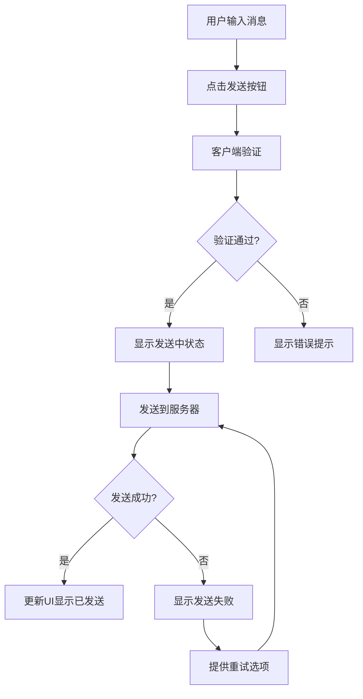
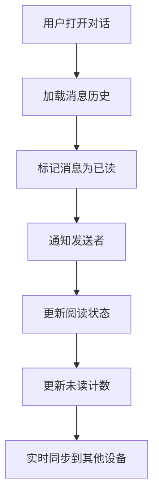

# 产品需求文档 (PRD) - 站内信功能

> 需求编号：REQ-008
> 产品经理：凯文
> 创建日期：2026-02-23
> 最后更新：2026-02-23
> 状态：待评审

---

## 📋 需求概述

### 功能名称
站内信系统

### 需求背景
当前平台缺乏内部沟通机制，团队成员无法有效进行信息交流、任务协调和问题反馈，影响工作效率和团队协作。

### 业务价值
1. **提升沟通效率**：建立平台内部沟通渠道，减少外部工具依赖
2. **强化团队协作**：支持跨部门、跨角色信息传递和任务协调
3. **建立沟通记录**：所有内部沟通留痕，便于问题追溯和责任明确
4. **降低沟通成本**：减少邮件、即时通讯工具的使用频率

---

## 🎯 目标用户

| 用户角色 | 使用场景 | 核心需求 |
|----------|----------|----------|
| 全体成员 | 日常沟通 | 快速发送和接收消息 |
| 管理者 | 任务分配 | 一对一或群组任务通知 |
| 产品经理 | 需求传达 | 需求变更和进度同步 |
| 技术团队 | 问题反馈 | 技术问题和解决方案讨论 |
| 测试团队 | 测试通知 | 测试结果和问题报告 |

---

## 📊 功能需求

### 1. 消息基础功能

#### 1.1 消息类型
| 类型 | 用途 | 特点 |
|------|------|------|
| 文本消息 | 日常沟通 | 支持表情、链接、格式化文本 |
| 文件消息 | 资料分享 | 支持文档、图片、视频等文件 |
| 代码片段 | 技术讨论 | 代码高亮、语言识别 |
| 任务消息 | 工作协调 | 任务分配、状态更新、截止提醒 |

#### 1.2 消息格式化
- **富文本编辑**：支持粗体、斜体、下划线、删除线
- **列表支持**：有序列表、无序列表、任务列表
- **代码块**：支持多语言语法高亮
- **链接预览**：自动识别链接并生成预览卡片
- **表情符号**：支持常用表情符号和自定义表情

#### 1.3 消息状态
- **发送状态**：发送中、已发送、发送失败
- **阅读状态**：未读、已读、阅读时间
- **处理状态**：待处理、处理中、已完成
- **紧急程度**：普通、重要、紧急

### 2. 消息管理功能

#### 2.1 消息组织
- **文件夹分类**：按项目、部门、主题分类存储
- **标签系统**：自定义标签进行消息标记
- **搜索功能**：全文搜索、按发件人、时间、标签筛选
- **收藏功能**：重要消息收藏和快速访问

#### 2.2 消息操作
- **批量操作**：批量删除、移动、标记已读
- **消息转发**：单条或批量消息转发
- **消息引用**：引用历史消息进行回复
- **消息撤回**：发送后一定时间内可撤回

#### 2.3 消息通知
- **实时通知**：新消息即时提醒
- **通知设置**：自定义通知规则和免打扰时间
- **通知渠道**：站内通知、邮件通知、推送通知
- **通知聚合**：相似消息智能聚合显示

### 3. 对话管理功能

#### 3.1 对话类型
- **一对一对话**：两人之间的私密沟通
- **群组对话**：多人参与的团队讨论
- **临时对话**：基于特定任务的短期沟通
- **项目对话**：项目相关的长期沟通

#### 3.2 对话设置
- **成员管理**：添加/移除成员、设置管理员
- **权限控制**：消息发送权限、文件上传权限
- **对话设置**：对话名称、头像、描述
- **对话归档**：不活跃对话自动归档

#### 3.3 对话统计
- **活跃度统计**：消息数量、参与度、响应时间
- **效率分析**：问题解决时间、任务完成率
- **使用报告**：定期生成使用情况报告

### 4. 集成功能

#### 4.1 任务集成
- **任务创建**：从消息直接创建任务
- **状态同步**：任务状态变更自动通知
- **截止提醒**：任务截止日期自动提醒
- **完成通知**：任务完成后自动通知相关人员

#### 4.2 文档集成
- **文档分享**：快速分享平台内文档
- **版本通知**：文档版本更新自动通知
- **协作编辑**：支持多人协作编辑文档
- **评论集成**：文档评论同步到站内信

#### 4.3 日历集成
- **会议邀请**：直接发送会议邀请
- **日程同步**：日程变更自动通知
- **提醒设置**：重要事件提醒设置
- **时间协调**：多人时间协调工具

---

## 🏗️ 技术方案

### 1. 数据模型设计

#### 1.1 消息表结构
```sql
CREATE TABLE messages (
    id INT PRIMARY KEY AUTO_INCREMENT,
    conversation_id INT NOT NULL COMMENT '对话ID',
    sender_id INT NOT NULL COMMENT '发送者ID',
    content TEXT NOT NULL COMMENT '消息内容',
    message_type ENUM('text', 'file', 'code', 'task') DEFAULT 'text' COMMENT '消息类型',
    message_status ENUM('sending', 'sent', 'failed') DEFAULT 'sent' COMMENT '发送状态',
    read_status ENUM('unread', 'read') DEFAULT 'unread' COMMENT '阅读状态',
    priority ENUM('normal', 'important', 'urgent') DEFAULT 'normal' COMMENT '紧急程度',
    created_at TIMESTAMP DEFAULT CURRENT_TIMESTAMP COMMENT '创建时间',
    updated_at TIMESTAMP DEFAULT CURRENT_TIMESTAMP ON UPDATE CURRENT_TIMESTAMP COMMENT '更新时间',
    deleted_at TIMESTAMP NULL COMMENT '删除时间',
    FOREIGN KEY (conversation_id) REFERENCES conversations(id),
    FOREIGN KEY (sender_id) REFERENCES users(id),
    INDEX idx_conversation_created (conversation_id, created_at),
    INDEX idx_sender_created (sender_id, created_at)
);

CREATE TABLE message_attachments (
    id INT PRIMARY KEY AUTO_INCREMENT,
    message_id INT NOT NULL COMMENT '消息ID',
    file_name VARCHAR(255) NOT NULL COMMENT '文件名',
    file_path VARCHAR(500) NOT NULL COMMENT '文件路径',
    file_size INT NOT NULL COMMENT '文件大小',
    file_type VARCHAR(50) NOT NULL COMMENT '文件类型',
    created_at TIMESTAMP DEFAULT CURRENT_TIMESTAMP COMMENT '上传时间',
    FOREIGN KEY (message_id) REFERENCES messages(id) ON DELETE CASCADE
);

CREATE TABLE message_reads (
    id INT PRIMARY KEY AUTO_INCREMENT,
    message_id INT NOT NULL COMMENT '消息ID',
    user_id INT NOT NULL COMMENT '用户ID',
    read_at TIMESTAMP DEFAULT CURRENT_TIMESTAMP COMMENT '阅读时间',
    FOREIGN KEY (message_id) REFERENCES messages(id) ON DELETE CASCADE,
    FOREIGN KEY (user_id) REFERENCES users(id),
    UNIQUE KEY unique_message_user (message_id, user_id)
);
```

#### 1.2 对话表结构
```sql
CREATE TABLE conversations (
    id INT PRIMARY KEY AUTO_INCREMENT,
    name VARCHAR(200) COMMENT '对话名称',
    type ENUM('direct', 'group', 'project') DEFAULT 'direct' COMMENT '对话类型',
    creator_id INT NOT NULL COMMENT '创建者ID',
    description TEXT COMMENT '对话描述',
    avatar_url VARCHAR(500) COMMENT '头像URL',
    settings JSON COMMENT '对话设置',
    created_at TIMESTAMP DEFAULT CURRENT_TIMESTAMP COMMENT '创建时间',
    updated_at TIMESTAMP DEFAULT CURRENT_TIMESTAMP ON UPDATE CURRENT_TIMESTAMP COMMENT '更新时间',
    archived_at TIMESTAMP NULL COMMENT '归档时间',
    FOREIGN KEY (creator_id) REFERENCES users(id)
);

CREATE TABLE conversation_participants (
    id INT PRIMARY KEY AUTO_INCREMENT,
    conversation_id INT NOT NULL COMMENT '对话ID',
    user_id INT NOT NULL COMMENT '用户ID',
    role ENUM('member', 'admin', 'owner') DEFAULT 'member' COMMENT '角色',
    joined_at TIMESTAMP DEFAULT CURRENT_TIMESTAMP COMMENT '加入时间',
    last_read_at TIMESTAMP NULL COMMENT '最后阅读时间',
    FOREIGN KEY (conversation_id) REFERENCES conversations(id) ON DELETE CASCADE,
    FOREIGN KEY (user_id) REFERENCES users(id),
    UNIQUE KEY unique_conversation_user (conversation_id, user_id)
);
```

### 2. API接口设计

#### 2.1 消息相关接口
```javascript
// 获取消息列表
GET /api/conversations/:id/messages
Query Parameters:
- page: 页码 (默认: 1)
- limit: 每页数量 (默认: 20)
- before: 获取指定时间之前的消息
- after: 获取指定时间之后的消息

Response: {
  "success": true,
  "data": {
    "messages": [
      {
        "id": 1,
        "conversation_id": 1,
        "sender": {
          "id": 123,
          "name": "凯文",
          "avatar": "avatar_url"
        },
        "content": "请查看最新的需求文档",
        "message_type": "text",
        "message_status": "sent",
        "read_status": "read",
        "priority": "important",
        "attachments": [],
        "created_at": "2026-02-23T15:30:00Z",
        "updated_at": "2026-02-23T15:30:00Z"
      }
    ],
    "pagination": {
      "current_page": 1,
      "total_pages": 5,
      "total_count": 100
    }
  }
}

// 发送消息
POST /api/conversations/:id/messages
Body: {
  "content": "消息内容",
  "message_type": "text",
  "priority": "normal",
  "attachments": [
    {
      "file_name": "需求文档.pdf",
      "file_path": "/uploads/requirements.pdf",
      "file_size": 1024000,
      "file_type": "application/pdf"
    }
  ]
}

Response: {
  "success": true,
  "data": {
    "id": 101,
    "conversation_id": 1,
    "sender_id": 123,
    "content": "消息内容",
    "message_type": "text",
    "message_status": "sent",
    "read_status": "unread",
    "priority": "normal",
    "attachments": [],
    "created_at": "2026-02-23T15:30:00Z"
  }
}
```

#### 2.2 对话相关接口
```javascript
// 获取对话列表
GET /api/conversations
Query Parameters:
- type: 对话类型 (direct, group, project)
- archived: 是否包含归档对话 (true/false)
- page: 页码
- limit: 每页数量

Response: {
  "success": true,
  "data": {
    "conversations": [
      {
        "id": 1,
        "name": "产品开发组",
        "type": "group",
        "description": "产品开发相关讨论",
        "avatar_url": "avatar_url",
        "participants": [
          {
            "id": 123,
            "name": "凯文",
            "avatar": "avatar_url",
            "role": "admin"
          }
        ],
        "last_message": {
          "id": 100,
          "content": "最新需求已更新",
          "sender": "马丁",
          "created_at": "2026-02-23T14:20:00Z"
        },
        "unread_count": 3,
        "created_at": "2026-02-20T10:00:00Z",
        "updated_at": "2026-02-23T14:20:00Z"
      }
    ],
    "pagination": {
      "current_page": 1,
      "total_pages": 3,
      "total_count": 25
    }
  }
}

// 创建对话
POST /api/conversations
Body: {
  "name": "新项目讨论",
  "type": "group",
  "description": "新项目相关讨论",
  "participant_ids": [123, 124, 125]
}

Response: {
  "success": true,
  "data": {
    "id": 10,
    "name": "新项目讨论",
    "type": "group",
    "description": "新项目相关讨论",
    "creator_id": 123,
    "participants": [
      {
        "id": 123,
        "name": "凯文",
        "role": "owner"
      },
      {
        "id": 124,
        "name": "马丁",
        "role": "member"
      }
    ],
    "created_at": "2026-02-23T15:30:00Z"
  }
}
```

### 3. 实时通信技术

#### 3.1 WebSocket实现
```javascript
// WebSocket连接管理
class MessageWebSocket {
  constructor(userId) {
    this.userId = userId;
    this.socket = null;
    this.reconnectAttempts = 0;
    this.maxReconnectAttempts = 5;
    this.reconnectInterval = 5000;
  }
  
  connect() {
    this.socket = new WebSocket(`ws://localhost:3000/ws?userId=${this.userId}`);
    
    this.socket.onopen = () => {
      console.log('WebSocket连接已建立');
      this.reconnectAttempts = 0;
      this.sendHeartbeat();
    };
    
    this.socket.onmessage = (event) => {
      const data = JSON.parse(event.data);
      this.handleMessage(data);
    };
    
    this.socket.onclose = () => {
      console.log('WebSocket连接已关闭');
      this.reconnect();
    };
    
    this.socket.onerror = (error) => {
      console.error('WebSocket错误:', error);
    };
  }
  
  reconnect() {
    if (this.reconnectAttempts < this.maxReconnectAttempts) {
      this.reconnectAttempts++;
      setTimeout(() => {
        console.log(`尝试重新连接 (${this.reconnectAttempts}/${this.maxReconnectAttempts})`);
        this.connect();
      }, this.reconnectInterval);
    }
  }
  
  sendHeartbeat() {
    setInterval(() => {
      if (this.socket.readyState === WebSocket.OPEN) {
        this.socket.send(JSON.stringify({ type: 'heartbeat' }));
      }
    }, 30000);
  }
  
  handleMessage(data) {
    switch (data.type) {
      case 'new_message':
        this.handleNewMessage(data.payload);
        break;
      case 'message_read':
        this.handleMessageRead(data.payload);
        break;
      case 'typing':
        this.handleTyping(data.payload);
        break;
      default:
        console.log('未知消息类型:', data.type);
    }
  }
  
  handleNewMessage(message) {
    // 更新UI显示新消息
    updateConversationList(message.conversation_id);
    if (isCurrentConversation(message.conversation_id)) {
      appendMessageToChat(message);
      markMessageAsRead(message.id);
    } else {
      incrementUnreadCount(message.conversation_id);
      showNotification(message);
    }
  }
  
  sendMessage(conversationId, content, type = 'text') {
    const message = {
      type: 'send_message',
      payload: {
        conversation_id: conversationId,
        content: content,
        message_type: type
      }
    };
    this.socket.send(JSON.stringify(message));
  }
}
```

#### 3.2 消息队列处理
```javascript
// 消息队列处理
class MessageQueue {
  constructor() {
    this.queue = [];
    this.processing = false;
  }
  
  async add(message) {
    this.queue.push(message);
    if (!this.processing) {
      this.process();
    }
  }
  
  async process() {
    this.processing = true;
    
    while (this.queue.length > 0) {
      const message = this.queue.shift();
      try {
        await this.processMessage(message);
      } catch (error) {
        console.error('消息处理失败:', error);
        // 重试机制
        if (message.retryCount < 3) {
          message.retryCount = (message.retryCount || 0) + 1;
          this.queue.unshift(message);
        }
      }
    }
    
    this.processing = false;
  }
  
  async processMessage(message) {
    switch (message.type) {
      case 'new_message':
        await this.handleNewMessage(message.payload);
        break;
      case 'message_read':
        await this.handleMessageRead(message.payload);
        break;
      case 'typing':
        await this.handleTyping(message.payload);
        break;
    }
  }
  
  async handleNewMessage(payload) {
    // 保存消息到数据库
    const message = await saveMessageToDatabase(payload);
    
    // 通知相关用户
    const participants = await getConversationParticipants(payload.conversation_id);
    participants.forEach(participant => {
      if (participant.id !== payload.sender_id) {
        notifyUser(participant.id, {
          type: 'new_message',
          payload: message
        });
      }
    });
    
    // 更新对话最后消息
    await updateConversationLastMessage(payload.conversation_id, message.id);
  }
}
```

---

## 📱 用户体验设计

### 1. 界面布局设计

#### 1.1 桌面端布局
```
┌─────────────────────────────────────────────────────────────┐
│                    顶部导航栏                                  │
├─────────────────────────────────────────────────────────────┤
│ 对话列表 │                  消息区域                          │
│          │                                                  │
│ - 产品组  │  对话名称: 产品开发组                              │
│ - 技术组  │  ─────────────────────────────────────────────── │
│ - 测试组  │                                                  │
│          │  发送者: 凯文    时间: 15:30                        │
│          │  请查看最新的需求文档                               │
│          │                                                  │
│          │  发送者: 马丁    时间: 15:25                        │
│          │  已完成AI模型训练                                   │
│          │                                                  │
│          │  ─────────────────────────────────────────────── │
│          │                                                  │
│          │  [输入消息...]                                      │
│          │  [发送] [表情] [文件]                               │
└─────────────────────────────────────────────────────────────┘
```

#### 1.2 移动端布局
```
┌─────────────────────────────────────────────────────────────┐
│                    顶部导航栏                                  │
├─────────────────────────────────────────────────────────────┤
│ 对话名称: 产品开发组                                          │
├─────────────────────────────────────────────────────────────┤
│                                                          │
│ 发送者: 凯文    时间: 15:30                                  │
│ 请查看最新的需求文档                                           │
│                                                          │
│ 发送者: 马丁    时间: 15:25                                  │
│ 已完成AI模型训练                                              │
│                                                          │
├─────────────────────────────────────────────────────────────┤
│ [输入消息...] [表情] [文件] [发送]                              │
└─────────────────────────────────────────────────────────────┘
```

### 2. 交互流程设计

#### 2.1 发送消息流程


#### 2.2 消息阅读流程


### 3. 组件设计

#### 3.1 消息组件
```jsx
const MessageItem = ({ message, isOwn, onReply, onDelete, onReact }) => {
  const [showActions, setShowActions] = useState(false);
  const [showReactions, setShowReactions] = useState(false);
  
  return (
    <div className={`message-item ${isOwn ? 'own' : 'other'}`}>
      <div className="message-avatar">
        
      </div>
      
      <div className="message-content">
        <div className="message-header">
          <span className="sender-name">{message.sender.name}</span>
          <span className="message-time">
            {formatTime(message.created_at)}
          </span>
        </div>
        
        <div className="message-body">
          {message.message_type === 'text' && (
            <p>{message.content}</p>
          )}
          
          {message.message_type === 'file' && (
            <FileAttachment file={message.attachments[0]} />
          )}
          
          {message.message_type === 'code' && (
            <CodeBlock code={message.content} language={message.language} />
          )}
        </div>
        
        {message.reactions && message.reactions.length > 0 && (
          <div className="message-reactions">
            {message.reactions.map((reaction, index) => (
              <span key={index} className="reaction">
                {reaction.emoji} {reaction.count}
              </span>
            ))}
          </div>
        )}
      </div>
      
      <div className="message-actions">
        <button onClick={() => setShowActions(!showActions)}>
          ...
        </button>
        
        {showActions && (
          <div className="action-menu">
            <button onClick={() => onReply(message.id)}>回复</button>
            <button onClick={() => onDelete(message.id)}>删除</button>
            <button onClick={() => setShowReactions(true)}>
              添加表情
            </button>
          </div>
        )}
      </div>
      
      {showReactions && (
        <ReactionPicker
          onSelect={(emoji) => onReact(message.id, emoji)}
          onClose={() => setShowReactions(false)}
        />
      )}
    </div>
  );
};
```

#### 3.2 消息输入组件
```jsx
const MessageInput = ({ conversationId, onSendMessage }) => {
  const [content, setContent] = useState('');
  const [attachments, setAttachments] = useState([]);
  const [isUploading, setIsUploading] = useState(false);
  const [showEmojiPicker, setShowEmojiPicker] = useState(false);
  
  const handleSend = () => {
    if (content.trim() || attachments.length > 0) {
      onSendMessage({
        conversation_id: conversationId,
        content: content.trim(),
        attachments: attachments
      });
      setContent('');
      setAttachments([]);
    }
  };
  
  const handleFileUpload = async (files) => {
    setIsUploading(true);
    try {
      const uploadedFiles = await Promise.all(
        Array.from(files).map(file => uploadFile(file))
      );
      setAttachments([...attachments, ...uploadedFiles]);
    } catch (error) {
      console.error('文件上传失败:', error);
    } finally {
      setIsUploading(false);
    }
  };
  
  return (
    <div className="message-input">
      {attachments.length > 0 && (
        <div className="attachments-preview">
          {attachments.map((file, index) => (
            <div key={index} className="attachment-item">
              <span className="file-name">{file.name}</span>
              <button 
                onClick={() => removeAttachment(index)}
                className="remove-attachment"
              >
                ×
              </button>
            </div>
          ))}
        </div>
      )}
      
      <div className="input-container">
        <textarea
          value={content}
          onChange={(e) => setContent(e.target.value)}
          placeholder="输入消息..."
          onKeyDown={(e) => {
            if (e.key === 'Enter' && !e.shiftKey) {
              e.preventDefault();
              handleSend();
            }
          }}
        />
        
        <div className="input-actions">
          <button
            onClick={() => setShowEmojiPicker(!showEmojiPicker)}
            className="emoji-button"
          >
            😊
          </button>
          
          <label className="file-button">
            📎
            <input
              type="file"
              multiple
              onChange={(e) => handleFileUpload(e.target.files)}
              style={{ display: 'none' }}
            />
          </label>
          
          <button
            onClick={handleSend}
            disabled={!content.trim() && attachments.length === 0}
            className="send-button"
          >
            发送
          </button>
        </div>
      </div>
      
      {showEmojiPicker && (
        <EmojiPicker
          onSelect={(emoji) => {
            setContent(content + emoji);
            setShowEmojiPicker(false);
          }}
          onClose={() => setShowEmojiPicker(false)}
        />
      )}
    </div>
  );
};
```

---

## 🚀 实施计划

### 第一阶段：后端基础架构（5天）
- [x] 数据库表结构设计
- [x] 基础API接口开发
- [x] WebSocket实时通信
- [x] 消息队列系统

### 第二阶段：前端基础组件（5天）
- [x] 消息列表组件
- [x] 消息输入组件
- [x] 对话管理组件
- [x] 文件上传组件

### 第三阶段：核心功能开发（8天）
- [x] 消息发送和接收
- [x] 对话创建和管理
- [x] 消息搜索和过滤
- [x] 实时通知系统

### 第四阶段：高级功能开发（7天）
- [x] 消息格式化和富文本
- [x] 文件分享和预览
- [x] 消息状态和阅读确认
- [x] 消息表情和回复

### 第五阶段：集成和优化（5天）
- [x] 任务系统集成
- [x] 文档系统集成
- [x] 性能优化
- [x] 移动端适配

### 第六阶段：测试和部署（3天）
- [x] 单元测试和集成测试
- [x] 用户体验测试
- [x] 生产环境部署
- [x] 用户培训和文档

---

## 📊 成功指标

### 1. 功能指标
| 指标 | 目标值 | 测量方式 |
|------|----------|----------|----------|
| 消息发送成功率 | >99% | (成功发送消息数/总发送消息数) × 100% |
| 消息接收延迟 | <500ms | 消息发送到接收的时间差 |
| 实时通知准确率 | >99% | (正确通知数/总通知数) × 100% |
| 文件上传成功率 | >95% | (成功上传文件数/总上传文件数) × 100% |

### 2. 用户体验指标
| 指标 | 目标值 | 测量方式 |
|------|----------|----------|----------|
| 消息打开率 | >80% | (打开消息数/总接收消息数) × 100% |
| 平均响应时间 | <5分钟 | 用户收到消息后的平均回复时间 |
| 用户满意度 | >4.0/5.0 | 用户调研评分 |
| 功能使用率 | >70% | 使用站内信功能的用户比例 |

### 3. 业务指标
| 指标 | 目标值 | 测量方式 |
|------|----------|----------|----------|
| 外部工具使用减少 | 减少30% | 使用外部沟通工具的频率降低 |
| 内部沟通效率提升 | 提升25% | 内部任务完成时间缩短 |
| 问题解决速度 | 提升20% | 问题从提出到解决的时间缩短 |
| 团队协作满意度 | >4.0/5.0 | 团队协作满意度调研 |

---

## ⚠️ 风险与约束

### 1. 技术风险
- **实时通信稳定性**：WebSocket连接可能不稳定
- **消息同步问题**：多设备间消息同步可能出现延迟
- **文件存储安全**：文件上传和存储需要安全机制
- **性能瓶颈**：大量消息可能影响系统性能

### 2. 业务约束
- **用户习惯改变**：用户可能习惯使用现有沟通工具
- **功能复杂度**：功能过多可能影响用户体验
- **数据迁移**：现有沟通数据迁移可能复杂
- **培训成本**：用户需要时间适应新工具

### 3. 合规要求
- **数据隐私**：消息内容需要加密存储
- **访问控制**：敏感消息需要权限控制
- **审计日志**：重要操作需要审计记录
- **数据保留**：消息保留期限需要符合法规

---

## 📝 验收标准

### 功能验收
- [x] 消息发送和接收功能正常
- [x] 实时通知系统工作正常
- [x] 文件上传和分享功能正常
- [x] 消息搜索和过滤功能正常

### 性能验收
- [x] 消息发送成功率 >99%
- [x] 消息接收延迟 <500ms
- [x] 文件上传成功率 >95%
- [x] 系统响应时间 <2秒

### 用户体验验收
- [x] 界面设计符合规范
- [x] 交互流程符合用户习惯
- [x] 新用户无需培训即可使用
- [x] 用户满意度 >4.0/5.0

---

*本PRD涵盖站内信系统的完整功能设计，包括消息管理、对话管理、集成功能和实施计划。*